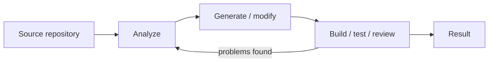
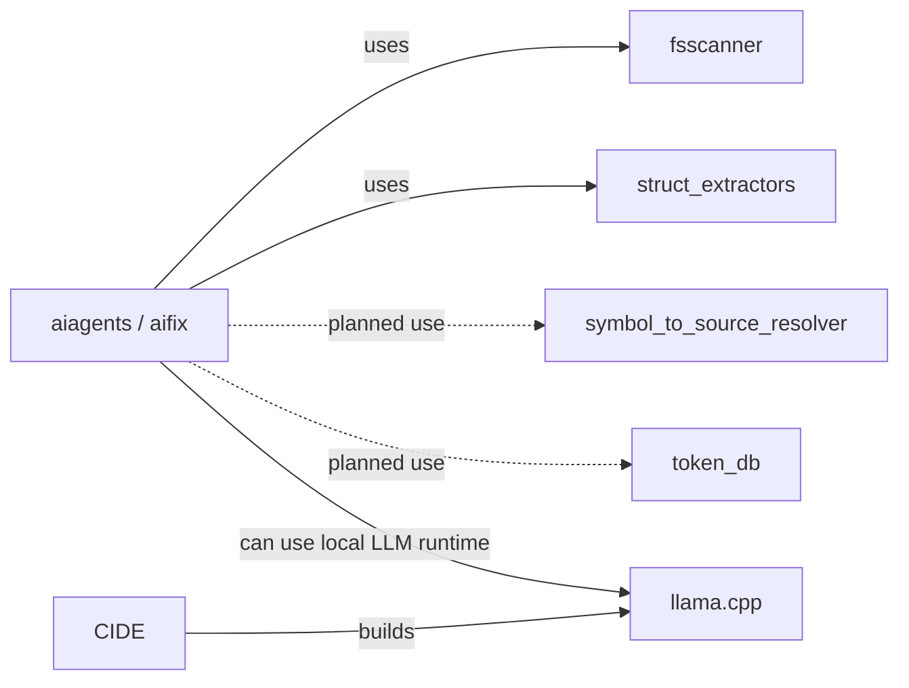
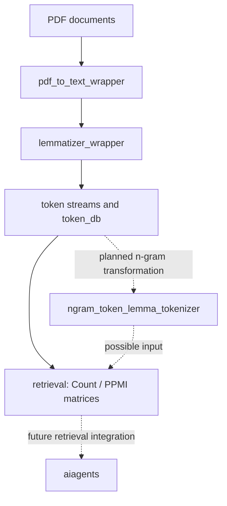
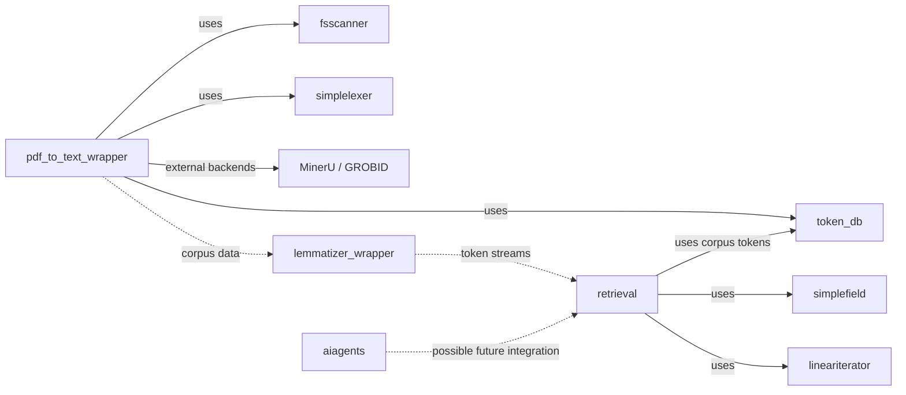
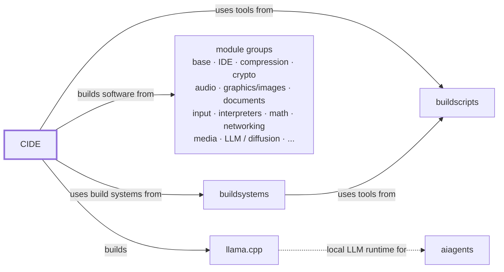
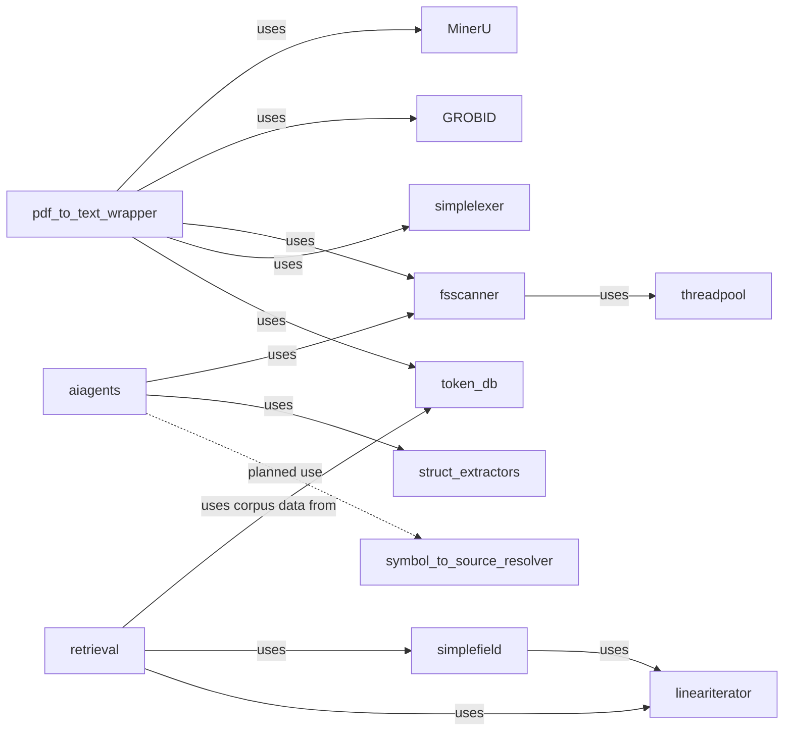

# Witold Kaminski

I build software systems and small, focused tools, mostly in Rust. My projects range from local AI experiments and document processing to build infrastructure, developer tooling, and low-level reusable libraries.

A recurring theme is to keep systems **small, explicit, inspectable, and locally controllable**: simple interfaces, limited dependencies, clear boundaries, and components that can be understood independently.

For implementation maturity and current limitations across the repositories, see **[Project progress](README_PROGRESS.md)**.

## Current projects

Two current lines of experimentation are deliberately separate: AI-assisted software engineering and local document/corpus processing. They are separate projects today, although the document-search capabilities are intended to become usable by `aiagents` later.

### AI-assisted software engineering

**[aiagents](https://github.com/witold-k/aiagents)** is an experimental local-first agentic runtime. `aifix` is one application/workflow built on it for AI-assisted software engineering: analysis, build/test/fix cycles, code and documentation generation, reviews, and release documentation.

- **[symbol_to_source_resolver](https://github.com/witold-k/symbol_to_source_resolver)** — experimental Rust library for mapping Rust, Java, and C/C++ symbols to candidate source files. Cargo metadata, conventional Maven source layouts, and `compile_commands.json` provide source discovery; tolerant parsing allows lookups despite source syntax errors. Integration into `aiagents` remains planned.

#### Workflow

#### Repository dependencies

### Local document processing and search

This is a separate line of work around preparing local documents as a searchable corpus and experimenting with token- and lemma-based representations. **SVD is not currently part of this search pipeline.**

- **[pdf_to_text_wrapper](https://github.com/witold-k/pdf_to_text_wrapper)** — offline PDF corpus preparation via external extraction backends such as MinerU and GROBID.
- **[lemmatizer_wrapper](https://github.com/witold-k/lemmatizer_wrapper)** — spaCy-backed lemmatization, token streams, and vocabulary preparation.
- **[ngram_token_lemma_tokenizer](https://github.com/witold-k/ngram_token_lemma_tokenizer)** — planned transformations of token/lemma streams into n-gram representations.
- **[token_db](https://github.com/witold-k/token_db)** — token IDs, occurrence counts, merging, and binary persistence.
- **[retrieval](https://github.com/witold-k/retrieval)** — formerly `corpus_matrix`. Its currently documented implementation constructs token co-occurrence Count and PPMI matrices from token streams. The broader search/retrieval approach is still evolving; this is not a claim of a finished search engine.

#### Data flow

PDF extraction is an offline preprocessing step, not part of regular query execution. The diagram describes the conceptual data flow, not necessarily direct crate dependencies. Further query matching and ranking remain subjects of development; no SVD-based retrieval is currently assumed.

#### Repository relationships

### Numerical experiments (independent)

**[svd_wrapper](https://github.com/witold-k/svd_wrapper)** is a standalone experimental library for backend-independent dense SVD using CPU/LAPACK, CUDA/cuSOLVER, and Julia. It is **not currently used for document search or retrieval**. It may be explored for that purpose in the future, but no dependency or integration is planned as a current implementation requirement.

## Build infrastructure

CIDE and its supporting repositories form a small build-infrastructure family. This diagram shows **repository/tool relationships** and the broad software groups represented by CIDE's module definitions, rather than singling out individual packages such as Neovim or tmux.

- **[cide](https://github.com/witold-k/cide)** — modular build environment for building software independently of the host system. It uses the build systems supplied by `buildsystems` and utilities from `buildscripts`. Its module definitions cover groups such as base software, IDE/tools, compression, cryptography, audio, graphics/images, documents, input, interpreters, mathematics, networking, media, and increasingly AI-related software such as LLM and diffusion components. In particular, CIDE builds `llama.cpp`, providing a locally controlled LLM runtime that is relevant to `aiagents`.
- **[buildsystems](https://github.com/witold-k/buildsystems)** — provides build systems and related tooling needed to build CIDE; it in turn uses utilities from `buildscripts`.
- **[buildscripts](https://github.com/witold-k/buildscripts)** — shared utilities used by both CIDE and `buildsystems`, alongside other personal helpers for build workflows, version control, containers, and related tasks.

## Development environment

**[neovim-tmux-integration](https://github.com/witold-k/neovim-tmux-integration)** is a separate project: my personal day-to-day development environment built around a persistent Neovim server inside tmux, with LSP, debugging, Git integration, build-output handling, and language-specific tooling.

There is a practical connection to CIDE, but not a repository dependency: Neovim and tmux are two packages in CIDE's broader `ide` module group, while `neovim-tmux-integration` configures and combines those tools into the environment I actually work in.

## Rust building blocks

Several repositories are deliberately small libraries. Some started because I needed a particular primitive elsewhere; others are experiments in API design, ownership, compile-time modelling, or low-level iteration.

| Project | Purpose |
| --- | --- |
| **[threadpool](https://github.com/witold-k/threadpool)** | Small fixed-size worker thread pool used by `fsscanner` for parallel jobs |
| **[fsscanner](https://github.com/witold-k/fsscanner)** | Directory-tree scanning and sequential/parallel file-processing pipelines |
| **[symbol_to_source_resolver](https://github.com/witold-k/symbol_to_source_resolver)** | Experimental Rust, Java, and C/C++ symbol-to-file lookup using Cargo metadata, Maven-style source directories, and `compile_commands.json`; future `aiagents` integration |
| **[struct_extractors](https://github.com/witold-k/struct_extractors)** | Procedural macros for accessors, comparators, hashing wrappers, numeric behavior, and enum checks |
| **[simplelexer](https://github.com/witold-k/simplelexer)** | Small zero-copy lexers for assignment-oriented text and `${...}` expressions |
| **[lineariterator](https://github.com/witold-k/lineariterator)** | Strided and fixed-window iteration, including low-level pointer APIs and safe wrappers |
| **[simplefield](https://github.com/witold-k/simplefield)** | Compact 2D contiguous storage with compile-time row-major/column-major layout |
| **[unitscale](https://github.com/witold-k/unitscale)** | Zero-overhead numeric wrappers for compile-time SI decimal scaling and angle representation |
| **[sequencetransform](https://github.com/witold-k/sequencetransform)** | Archive of sequence-processing ideas and experiments: composable transforms/selectors, trigger-based two-sequence processing, and ordinal-pattern tokenization of sliding windows |
| **[logicequation](https://github.com/witold-k/logicequation)** | Experimental symbolic Boolean-expression and bit-vector library built around shared logic graphs; my first Rust library, now polished and documented but currently on ice because its original use case is no longer active |

### Library dependencies

Every arrow below explicitly reads as **"uses"**.

## Why so many small repositories?

The many small libraries are intentional. I prefer each library to solve one
narrow problem with a small interface and as few dependencies as practical.
The goal is less long-term maintenance, not more: once a component does its
job reliably, it should need little attention and should not have to grow along
with every project that uses it.

The larger systems can grow organically by combining these relatively stable
building blocks. Separate repositories are useful when they keep responsibilities
and dependencies independent; they are not meant to turn every small idea into
an actively maintained product.

## What ties these projects together?

They are not intended to form one monolithic framework. The common thread is the way I like to explore software:

- build a real component to understand a problem;
- keep abstractions narrow and boundaries explicit;
- prefer inspectable mechanisms over unnecessary complexity;
- use Rust where ownership, performance, or strong compile-time modelling are useful;
- experiment across layers — from low-level iteration and numerical code to build infrastructure and AI workflows.

Most repositories are personal or experimental projects and are at different levels of maturity. Their individual READMEs describe the current status and limitations.

## Background

For a more conventional overview of my professional background, see **[my CV repository](https://github.com/witold-k/cv)**.
