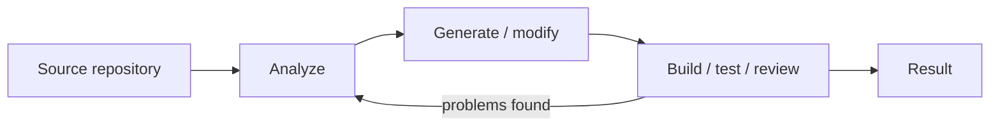
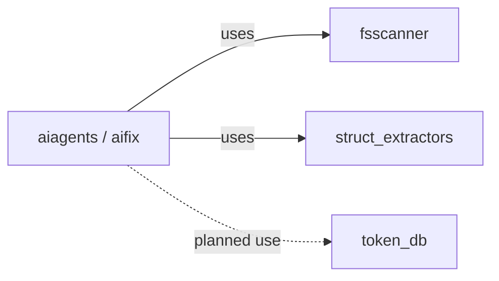
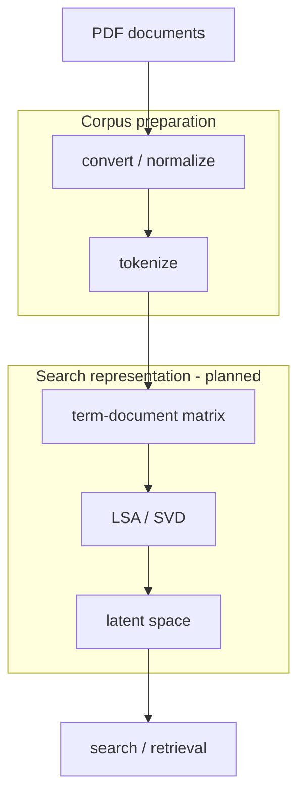
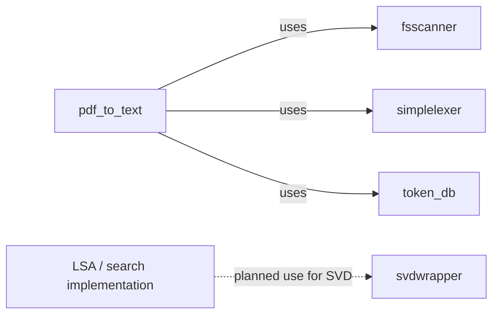
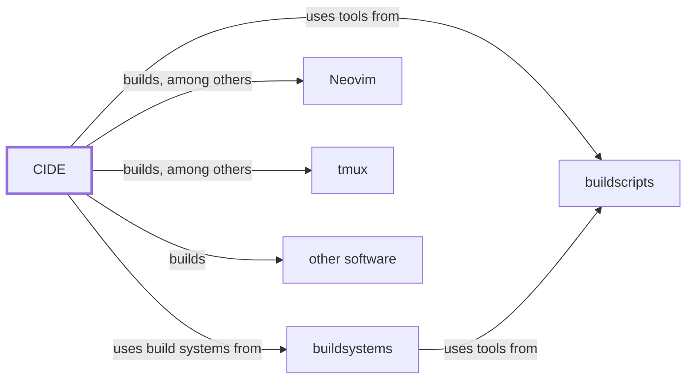
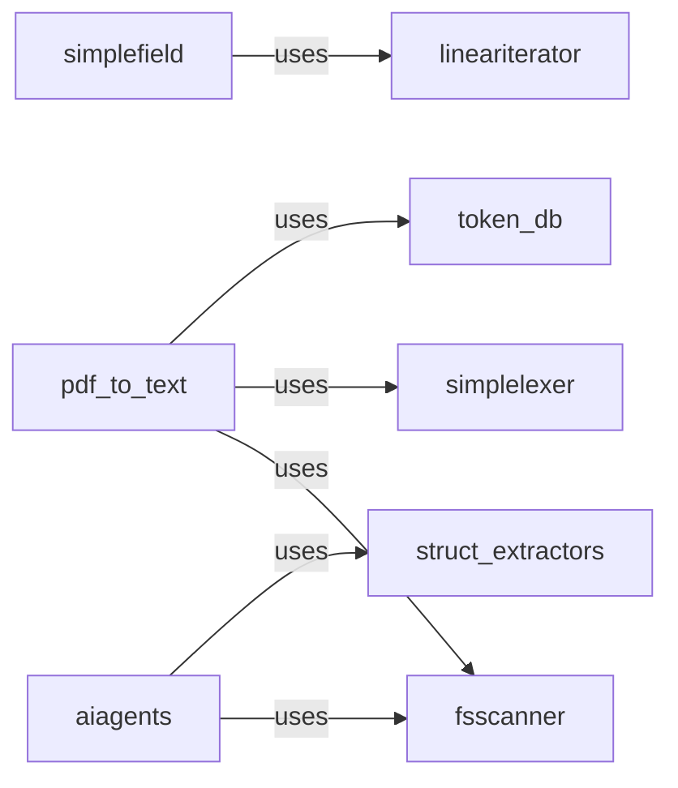

# Witold Kaminski

I build software systems and small, focused tools, mostly in Rust. My projects range from local AI experiments and document processing to build infrastructure, developer tooling, and low-level reusable libraries.

A recurring theme is to keep systems **small, explicit, inspectable, and locally controllable**: simple interfaces, limited dependencies, clear boundaries, and components that can be understood independently.

## Current projects

Two current lines of experimentation are deliberately separate: AI-assisted software engineering and local document/corpus processing.

### AI-assisted software engineering

**[aiagents](https://github.com/witold-k/aiagents)** is an experimental local-first agentic runtime. `aifix` is one application/workflow built on it for AI-assisted software engineering: analysis, build/test/fix cycles, code and documentation generation, reviews, and release documentation.

#### Workflow

#### Repository dependencies

### Local document processing and search

This is a separate line of work around turning local documents into a searchable corpus and experimenting with classical numerical search methods, in particular LSA based on SVD.

- **[pdf_to_text](https://github.com/witold-k/pdf_to_text)** — corpus-preparation pipeline that turns PDFs into structured text and token data.
- **[token_db](https://github.com/witold-k/token_db)** — compact Rust token database with stable numeric IDs, frequency tracking, merging, and binary persistence.
- **[svdwrapper](https://github.com/witold-k/svdwrapper)** — experimental backend-independent dense SVD interface with CPU/LAPACK, CUDA/cuSOLVER, and Julia implementations. A planned use is the SVD step of an LSA-based local document-search pipeline.

#### Data flow

This groups the pipeline into two conceptual stages instead of stretching every processing step across one long row. Corpus preparation is the current direction; the search-representation stage, including LSA/SVD and latent-space retrieval, is planned.

#### Repository dependencies

## Build infrastructure

CIDE and its supporting repositories form a small build-infrastructure family. This diagram shows **repository/tool relationships**, not a build signal flow.

- **[cide](https://github.com/witold-k/cide)** — modular build environment for building software independently of the host system. It uses the build systems supplied by `buildsystems` and utilities from `buildscripts`. Among many other packages, CIDE can build Neovim and tmux.
- **[buildsystems](https://github.com/witold-k/buildsystems)** — provides build systems and related tooling needed to build CIDE; it in turn uses utilities from `buildscripts`.
- **[buildscripts](https://github.com/witold-k/buildscripts)** — shared utilities used by both CIDE and `buildsystems`, alongside other personal helpers for build workflows, version control, containers, and related tasks.

## Development environment

**[neovim-tmux-integration](https://github.com/witold-k/neovim-tmux-integration)** is a separate project: my personal day-to-day development environment built around a persistent Neovim server inside tmux, with LSP, debugging, Git integration, build-output handling, and language-specific tooling.

There is a practical connection to CIDE, but not a repository dependency: CIDE can build Neovim and tmux as software packages, while `neovim-tmux-integration` configures and combines those tools into the environment I actually work in.

## Rust building blocks

Several repositories are deliberately small libraries. Some started because I needed a particular primitive elsewhere; others are experiments in API design, ownership, compile-time modelling, or low-level iteration.

| Project | Purpose |
| --- | --- |
| **[fsscanner](https://github.com/witold-k/fsscanner)** | Directory-tree scanning and sequential/parallel file-processing pipelines |
| **[struct_extractors](https://github.com/witold-k/struct_extractors)** | Procedural macros for accessors, comparators, hashing wrappers, numeric behavior, and enum checks |
| **[simplelexer](https://github.com/witold-k/simplelexer)** | Small zero-copy lexers for assignment-oriented text and `${...}` expressions |
| **[lineariterator](https://github.com/witold-k/lineariterator)** | Strided and fixed-window iteration, including low-level pointer APIs and safe wrappers |
| **[simplefield](https://github.com/witold-k/simplefield)** | Compact 2D contiguous storage with compile-time row-major/column-major layout |
| **[unitscale](https://github.com/witold-k/unitscale)** | Zero-overhead numeric wrappers for compile-time SI decimal scaling and angle representation |

### Library dependencies

Every arrow below explicitly reads as **"uses"**.

## What ties these projects together?

They are not intended to form one monolithic framework. The common thread is the way I like to explore software:

- build a real component to understand a problem;
- keep abstractions narrow and boundaries explicit;
- prefer inspectable mechanisms over unnecessary complexity;
- use Rust where ownership, performance, or strong compile-time modelling are useful;
- experiment across layers — from low-level iteration and numerical code to build infrastructure and AI workflows.

Most repositories are personal or experimental projects and are at different levels of maturity. Their individual READMEs describe the current status and limitations.

## Background

For a more conventional overview of my professional background, see **[my CV repository](https://github.com/witold-k/cv)**.
