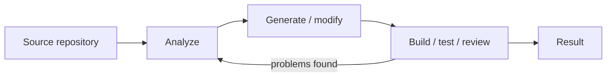
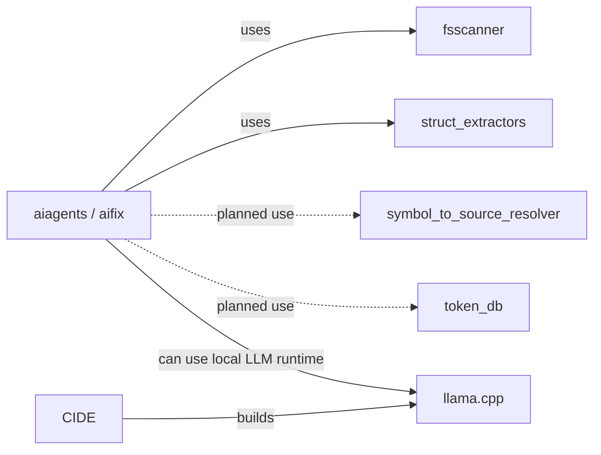
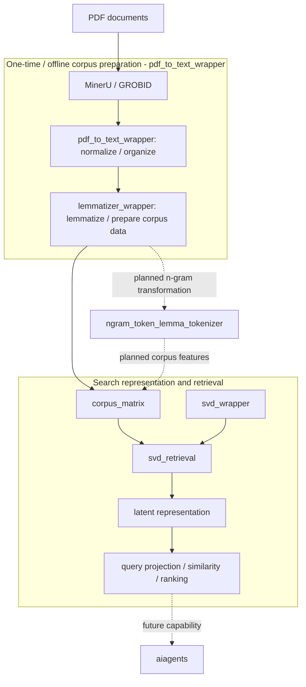
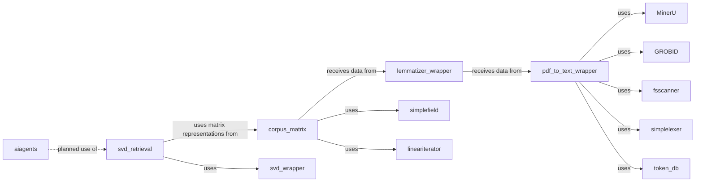
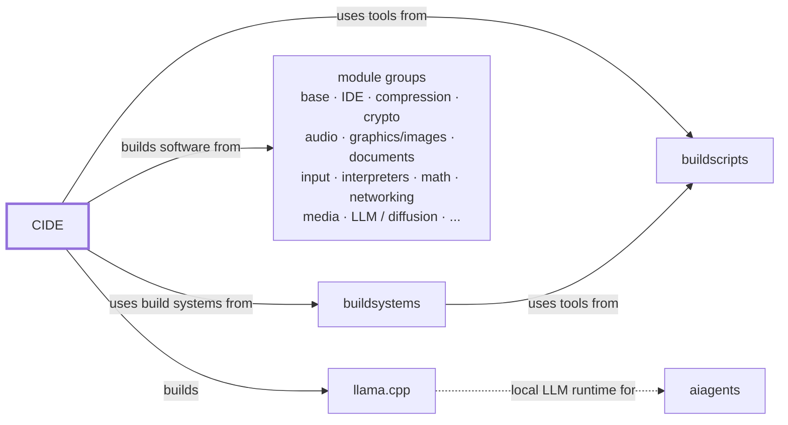
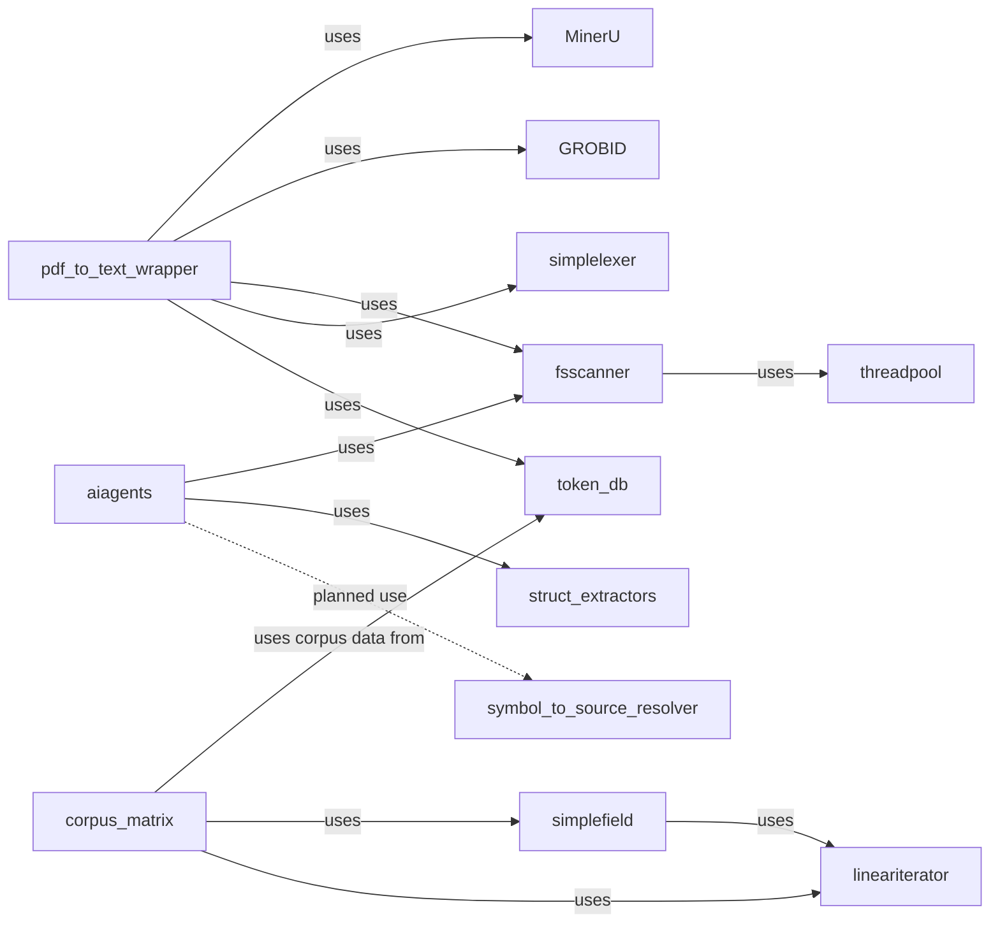

# Witold Kaminski

I build software systems and small, focused tools, mostly in Rust. My projects range from local AI experiments and document processing to build infrastructure, developer tooling, and low-level reusable libraries.

A recurring theme is to keep systems **small, explicit, inspectable, and locally controllable**: simple interfaces, limited dependencies, clear boundaries, and components that can be understood independently.

## Current projects

Two current lines of experimentation are deliberately separate: AI-assisted software engineering and local document/corpus processing. They are separate projects today, although the document-search capabilities are intended to become usable by `aiagents` later.

### AI-assisted software engineering

**[aiagents](https://github.com/witold-k/aiagents)** is an experimental local-first agentic runtime. `aifix` is one application/workflow built on it for AI-assisted software engineering: analysis, build/test/fix cycles, code and documentation generation, reviews, and release documentation.

- **[symbol_to_source_resolver](https://github.com/witold-k/symbol_to_source_resolver)** — planned, not yet implemented Rust library to resolve qualified C/C++, Rust, and Java symbols to one or more source files. Intended for future use by `aiagents` to find source locations from symbol names.

#### Workflow

#### Repository dependencies

### Local document processing and search

This is a separate line of work around turning local documents into a searchable corpus and experimenting with classical numerical search methods, in particular latent representations based on SVD/LSA-style techniques.

- **[pdf_to_text_wrapper](https://github.com/witold-k/pdf_to_text_wrapper)** — offline corpus-preparation wrapper/orchestration layer. It delegates PDF extraction to external backends such as MinerU and GROBID, then normalizes their output and prepares structured text and token data for the corpus. This is normally a one-time preprocessing step when documents are added or rebuilt, not part of the regular search/runtime path.
- **[lemmatizer_wrapper](https://github.com/witold-k/lemmatizer_wrapper)** — spaCy-backed Markdown-corpus lemmatization. Produces document-local token streams and token databases in two passes, merges a global vocabulary, and preserves linguistic annotations such as POS and dependency information.
- **[ngram_token_lemma_tokenizer](https://github.com/witold-k/ngram_token_lemma_tokenizer)** — new Rust project for transforming existing token streams into unigram, bigram, and trigram representations, with plans to combine surface forms, lemmas, stems, and POS annotations. The transformation design is being developed; these features are not yet implemented.
- **[token_db](https://github.com/witold-k/token_db)** — compact Rust token database with stable numeric IDs, frequency tracking, merging, and binary persistence.
- **[corpus_matrix](https://github.com/witold-k/corpus_matrix)** — currently builds token/lemma co-occurrence count and PPMI matrices using sliding windows. The same matrix builders could later process transformed n-gram streams to explore bigram-by-bigram and trigram-by-trigram representations.
- **[svd_wrapper](https://github.com/witold-k/svd_wrapper)** — experimental backend-independent dense SVD interface with CPU/LAPACK, CUDA/cuSOLVER, and Julia implementations.
- **[svd_retrieval](https://github.com/witold-k/svd_retrieval)** — retrieval layer for the SVD-based document-search experiment. It combines corpus-derived matrices with `svd_wrapper` to build latent representations, project queries into the same space, compare them with indexed content, and rank retrieval results.

#### Data flow

The corpus data pipeline passes Markdown output from `pdf_to_text_wrapper` to `lemmatizer_wrapper`, which produces lemma token streams, local/global token IDs, and spaCy annotations. The resulting streams can feed `corpus_matrix`. The new `ngram_token_lemma_tokenizer` is intended as an optional transformation stage between corpus preparation and matrix building; its proposed n-gram outputs are not implemented yet. This describes data flow, not necessarily direct Rust crate dependencies.

The `pdf_to_text_wrapper` stage is preprocessing: it normally runs only when corpus data needs to be created or refreshed and is not part of regular query execution.

`corpus_matrix` is the matrix-construction stage of this pipeline. The representation is intentionally open to experimentation: it may be a conventional term-document representation, but it may also encode word co-occurrence, for example by counting words that occur together within a sliding window.

`svd_retrieval` is the retrieval-specific layer above those matrices. It uses `svd_wrapper` for dense SVD and is intended to own the parts that turn a corpus representation into something searchable: latent-space construction, document or chunk representation, query projection, similarity calculation, and ranking. The exact retrieval model is still deliberately experimental rather than fixed behind a premature abstraction.

Corpus preparation, matrix construction, and the SVD-based retrieval layer now have dedicated repositories. Integration with `aiagents` remains a future step.

#### Repository dependencies

## Build infrastructure

CIDE and its supporting repositories form a small build-infrastructure family. This diagram shows **repository/tool relationships** and the broad software groups represented by CIDE's module definitions, rather than singling out individual packages such as Neovim or tmux.

- **[cide](https://github.com/witold-k/cide)** — modular build environment for building software independently of the host system. It uses the build systems supplied by `buildsystems` and utilities from `buildscripts`. Its module definitions cover groups such as base software, IDE/tools, compression, cryptography, audio, graphics/images, documents, input, interpreters, mathematics, networking, media, and increasingly AI-related software such as LLM and diffusion components. In particular, CIDE builds `llama.cpp`, providing a locally controlled LLM runtime that is relevant to `aiagents`.
- **[buildsystems](https://github.com/witold-k/buildsystems)** — provides build systems and related tooling needed to build CIDE; it in turn uses utilities from `buildscripts`.
- **[buildscripts](https://github.com/witold-k/buildscripts)** — shared utilities used by both CIDE and `buildsystems`, alongside other personal helpers for build workflows, version control, containers, and related tasks.

## Development environment

**[neovim-tmux-integration](https://github.com/witold-k/neovim-tmux-integration)** is a separate project: my personal day-to-day development environment built around a persistent Neovim server inside tmux, with LSP, debugging, Git integration, build-output handling, and language-specific tooling.

There is a practical connection to CIDE, but not a repository dependency: Neovim and tmux are two packages in CIDE's broader `ide` module group, while `neovim-tmux-integration` configures and combines those tools into the environment I actually work in.

## Rust building blocks

Several repositories are deliberately small libraries. Some started because I needed a particular primitive elsewhere; others are experiments in API design, ownership, compile-time modelling, or low-level iteration.

| Project | Purpose |
| --- | --- |
| **[threadpool](https://github.com/witold-k/threadpool)** | Small fixed-size worker thread pool used by `fsscanner` for parallel jobs |
| **[fsscanner](https://github.com/witold-k/fsscanner)** | Directory-tree scanning and sequential/parallel file-processing pipelines |
| **[symbol_to_source_resolver](https://github.com/witold-k/symbol_to_source_resolver)** | Planned, not yet implemented symbol-to-source lookup library for C/C++, Rust, and Java; intended for future use by `aiagents` |
| **[struct_extractors](https://github.com/witold-k/struct_extractors)** | Procedural macros for accessors, comparators, hashing wrappers, numeric behavior, and enum checks |
| **[simplelexer](https://github.com/witold-k/simplelexer)** | Small zero-copy lexers for assignment-oriented text and `${...}` expressions |
| **[lineariterator](https://github.com/witold-k/lineariterator)** | Strided and fixed-window iteration, including low-level pointer APIs and safe wrappers |
| **[simplefield](https://github.com/witold-k/simplefield)** | Compact 2D contiguous storage with compile-time row-major/column-major layout |
| **[unitscale](https://github.com/witold-k/unitscale)** | Zero-overhead numeric wrappers for compile-time SI decimal scaling and angle representation |
| **[sequencetransform](https://github.com/witold-k/sequencetransform)** | Archive of sequence-processing ideas and experiments: composable transforms/selectors, trigger-based two-sequence processing, and ordinal-pattern tokenization of sliding windows |
| **[logicequation](https://github.com/witold-k/logicequation)** | Experimental symbolic Boolean-expression and bit-vector library built around shared logic graphs; my first Rust library, now polished and documented but currently on ice because its original use case is no longer active |

### Library dependencies

Every arrow below explicitly reads as **"uses"**.

## What ties these projects together?

They are not intended to form one monolithic framework. The common thread is the way I like to explore software:

- build a real component to understand a problem;
- keep abstractions narrow and boundaries explicit;
- prefer inspectable mechanisms over unnecessary complexity;
- use Rust where ownership, performance, or strong compile-time modelling are useful;
- experiment across layers — from low-level iteration and numerical code to build infrastructure and AI workflows.

Most repositories are personal or experimental projects and are at different levels of maturity. Their individual READMEs describe the current status and limitations.

## Background

For a more conventional overview of my professional background, see **[my CV repository](https://github.com/witold-k/cv)**.