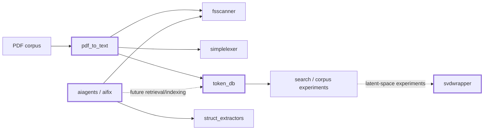
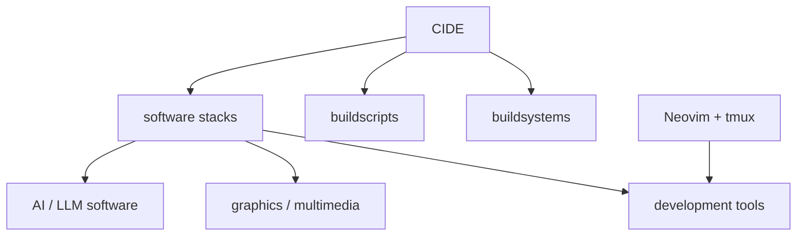
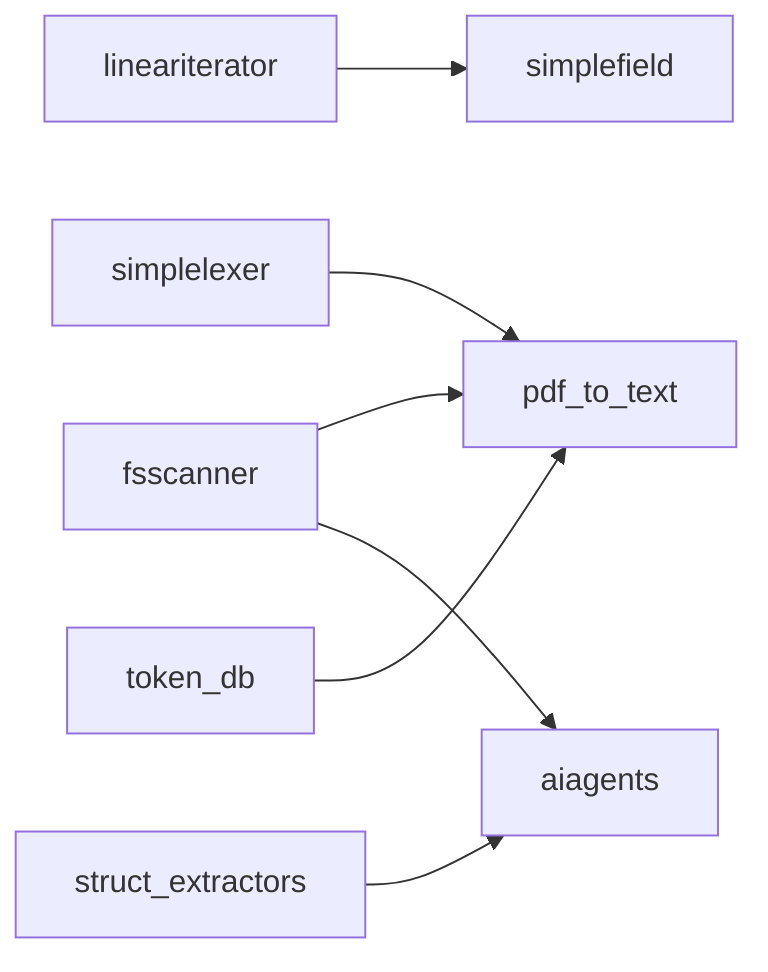

# Witold Kaminski

I build software systems and small, focused tools, mostly in Rust. My projects range from local AI experiments and document processing to build environments, developer tooling, and low-level reusable libraries.

A recurring theme is to keep systems **small, explicit, inspectable, and locally controllable**: simple interfaces, limited dependencies, clear boundaries, and components that can be understood independently.

## Current focus

My current experiments connect **local AI**, **document/corpus processing**, and **numerical methods**.

### AI & local information processing

- **[aiagents](https://github.com/witold-k/aiagents)** — experimental local-first agentic runtime for AI-assisted software engineering. It runs multi-step workflows for analysis, build/test/fix cycles, code and documentation generation, reviews, and release documentation.
- **[pdf_to_text](https://github.com/witold-k/pdf_to_text)** — corpus-preparation pipeline that turns PDFs into structured text and token data, currently using GROBID together with my filesystem and tokenization components.
- **[token_db](https://github.com/witold-k/token_db)** — compact Rust token database with stable numeric IDs, frequency tracking, merging, and binary persistence.
- **[svdwrapper](https://github.com/witold-k/svdwrapper)** — experimental backend-independent dense SVD interface with CPU/LAPACK, CUDA/cuSOLVER, and Julia implementations. One motivation is experimentation with classical latent-space methods for local document search.

## Build systems & development environment

A second group of projects grew out of building my own development environment and software stacks.

- **[cide](https://github.com/witold-k/cide)** — modular build environment for constructing complete software stacks independently of the host system. Its guiding idea is: **build the software, not the operating system**.
- **[buildsystems](https://github.com/witold-k/buildsystems)** — build-system/tooling definitions used as part of CIDE.
- **[buildscripts](https://github.com/witold-k/buildscripts)** — personal utilities for build workflows, version control, containers, and related development tasks.
- **[neovim-tmux-integration](https://github.com/witold-k/neovim-tmux-integration)** — my persistent Neovim + tmux development environment, including LSP, debugging, Git, build-output handling, and language-specific tooling.

## Rust building blocks

Several repositories are deliberately small libraries. Some started because I needed a particular primitive elsewhere; others are experiments in API design, ownership, compile-time modelling, or low-level iteration.

| Project | Purpose |
| --- | --- |
| **[fsscanner](https://github.com/witold-k/fsscanner)** | Directory-tree scanning and sequential/parallel file-processing pipelines |
| **[struct_extractors](https://github.com/witold-k/struct_extractors)** | Procedural macros for accessors, comparators, hashing wrappers, numeric behavior, and enum checks |
| **[simplelexer](https://github.com/witold-k/simplelexer)** | Small zero-copy lexers for assignment-oriented text and `${...}` expressions |
| **[lineariterator](https://github.com/witold-k/lineariterator)** | Strided and fixed-window iteration, including low-level pointer APIs and safe wrappers |
| **[simplefield](https://github.com/witold-k/simplefield)** | Compact 2D contiguous storage with compile-time row-major/column-major layout |
| **[unitscale](https://github.com/witold-k/unitscale)** | Zero-overhead numeric wrappers for compile-time SI decimal scaling and angle representation |

Some of these components form small dependency chains of their own:

## What ties these projects together?

They are not intended to form one monolithic framework. The common thread is the way I like to explore software:

- build a real component to understand a problem;
- keep abstractions narrow and boundaries explicit;
- prefer inspectable mechanisms over unnecessary complexity;
- use Rust where ownership, performance, or strong compile-time modelling are useful;
- experiment across layers — from low-level iteration and numerical code to build systems and AI workflows.

Most repositories are personal or experimental projects and are at different levels of maturity. Their individual READMEs describe the current status and limitations.

## Background

For a more conventional overview of my professional background, see **[my CV repository](https://github.com/witold-k/cv)**.
